# RemindMeAT
Remind Me At is a location-based reminder application for the android platform.
Splash Screen

Format: 

Sign Up
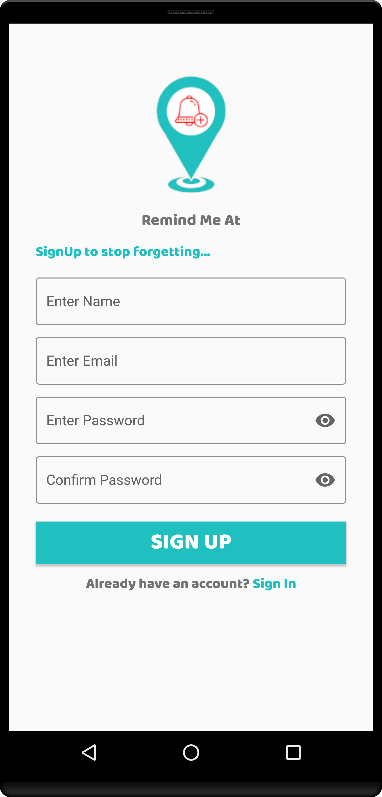
Format: 

Login
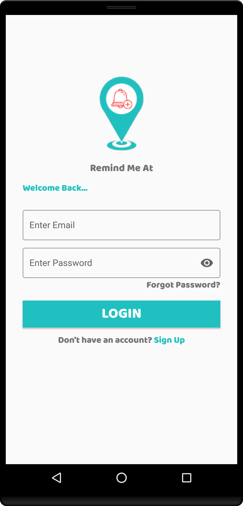
Format: 

Forgot Pass
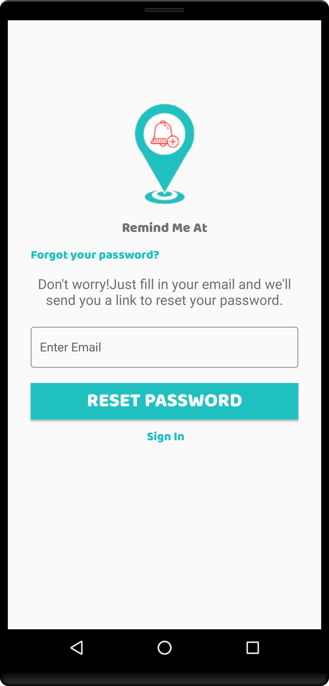
Format: 

Home Screen
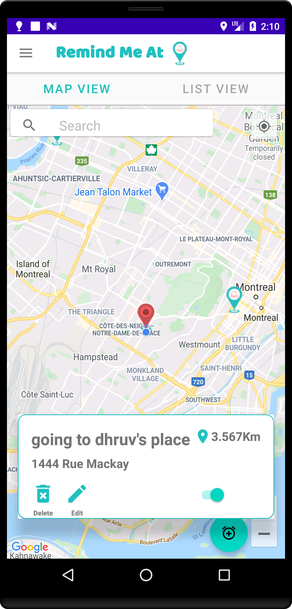
Format: 

List View
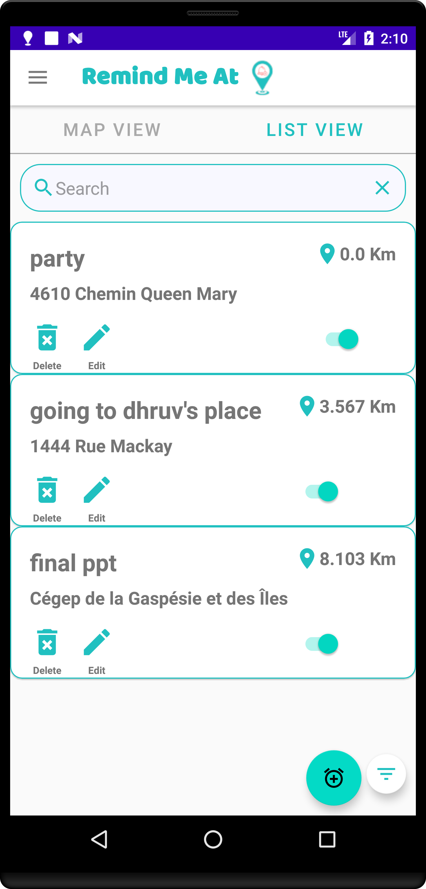
Format: 

Reminder Filter
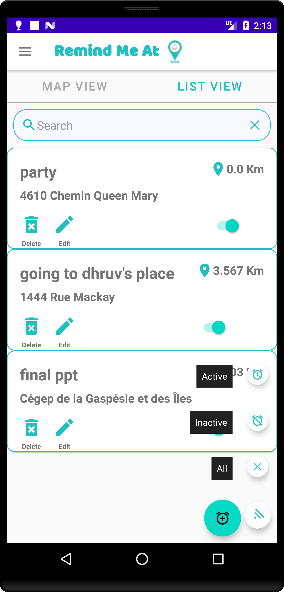
Format: 

Reminder Details
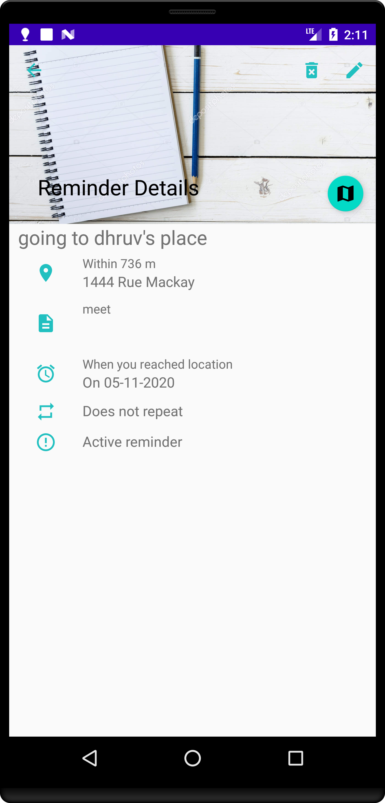
Format: 

Add Reminder Screen
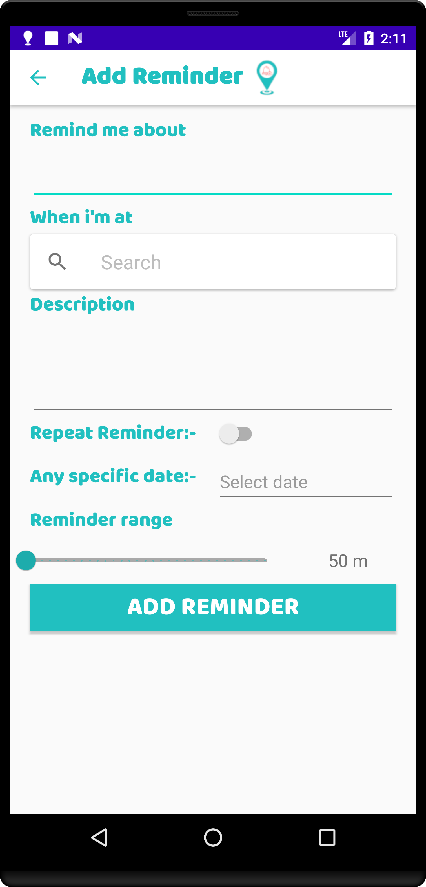
Format: 

Edit Reminder Screen

Format: 

Profile Screen
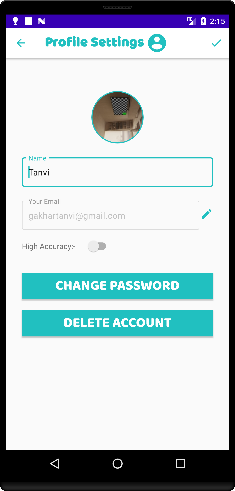
Format: 

Reminder History
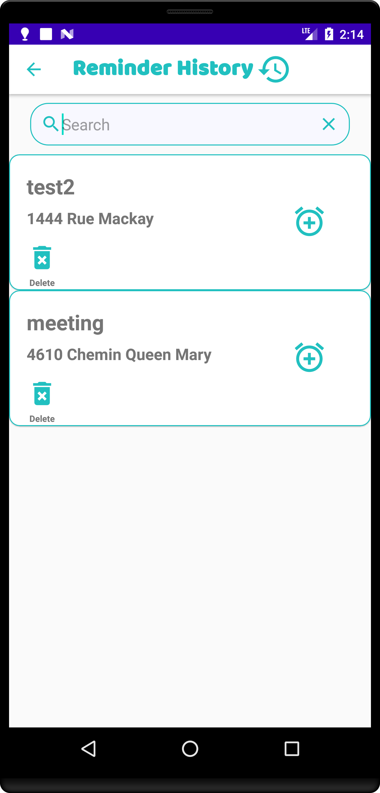
Format: 

Drawer Menu
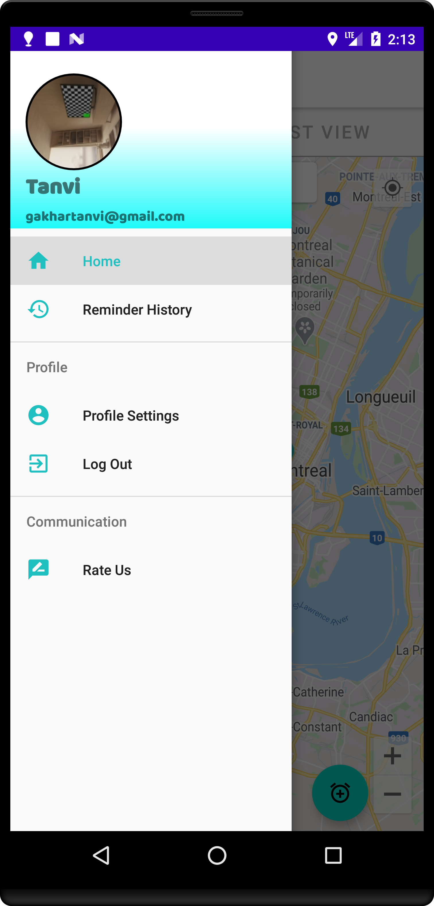
Format: 

FeedBack Screen 
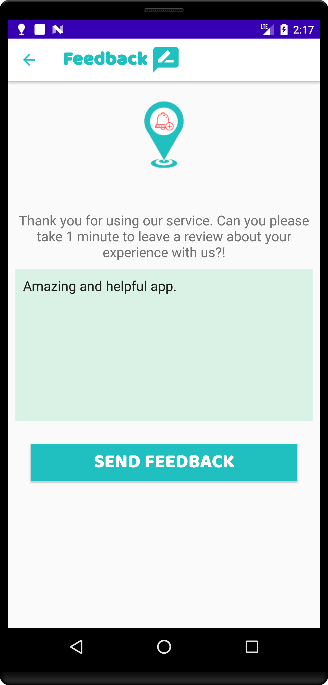
Format: 

Reminder Notification  
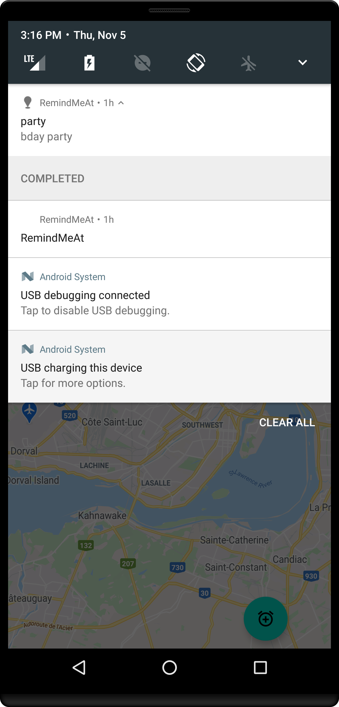
Format: 

Reminder View Notification  
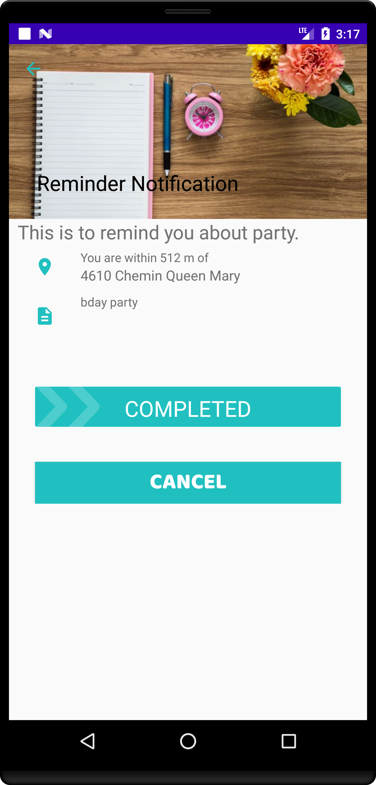
Format: 

Admin Home Screen  
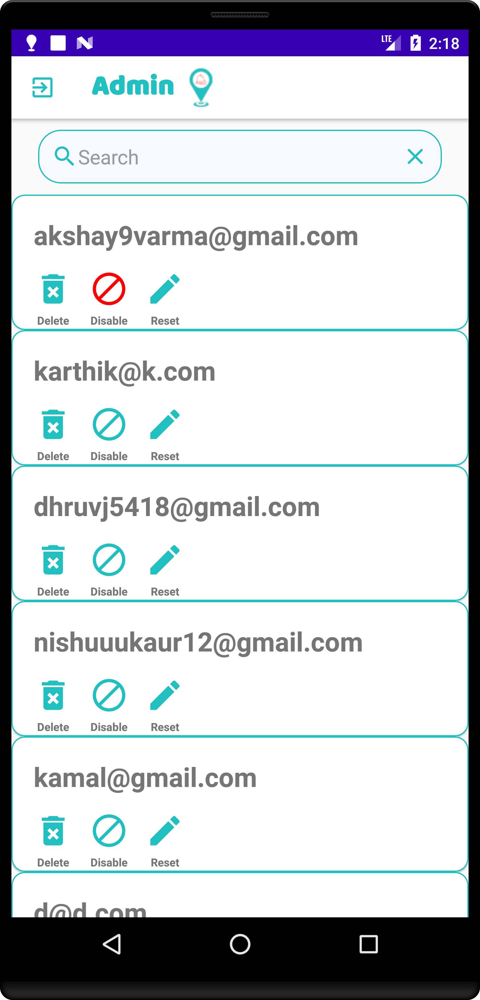
Format: 

